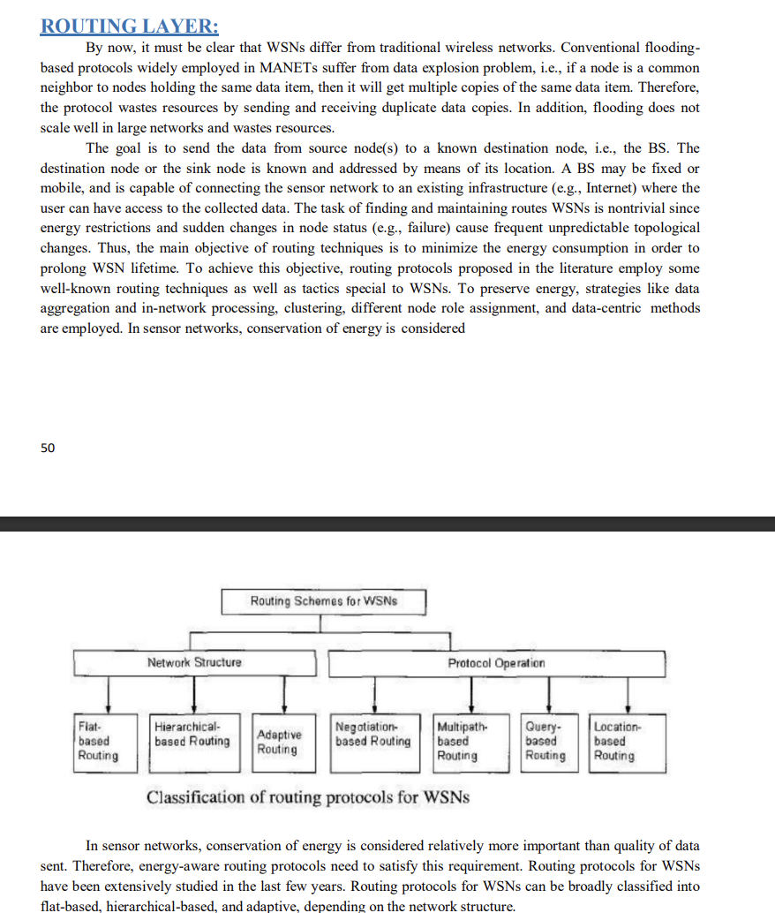
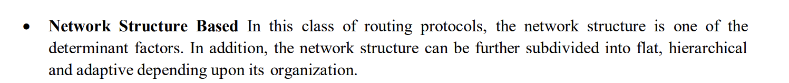
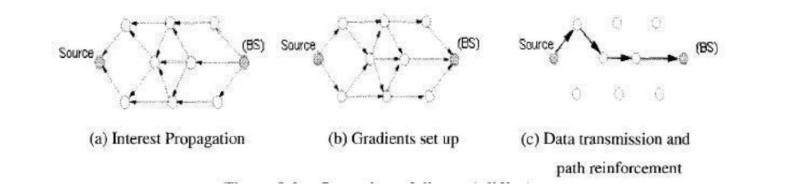
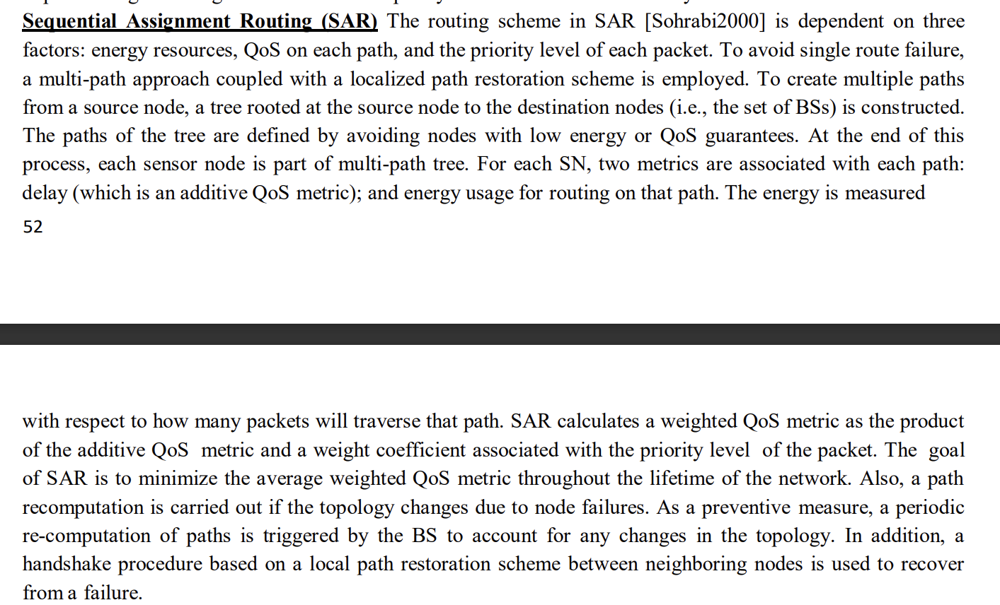
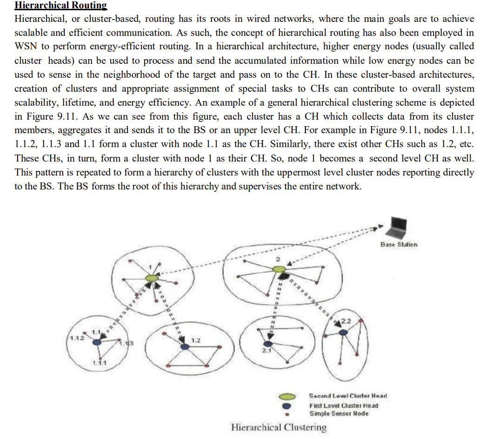
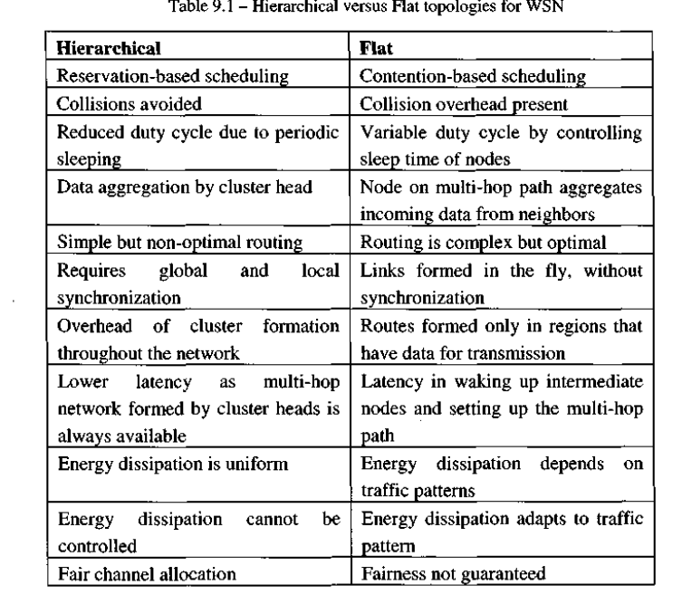

# Unit1
#unit1 

[Characteristics of MANETs](https://www.geeksforgeeks.org/introduction-of-mobile-ad-hoc-network-manet/)  
[Application of manet](https://www.javatpoint.com/mobile-adhoc-network)  

> ***Challenges in Manet***
> 
> Mobile Ad hoc Networks (MANETs) present several challenges due to their unique characteristics and dynamic nature. Some of the key challenges faced in MANETs include:
>  
>  1. Limited Network Resources: MANETs typically have limited resources in terms of bandwidth, processing power, and energy. Since the nodes in the network are mobile and operate on battery power, resource constraints become a significant challenge.
>  
>  2. Dynamic Network Topology: Nodes in MANETs can join or leave the network at any time, leading to a highly dynamic network topology. This dynamic nature makes routing and maintaining connectivity between nodes challenging.
>  
>  3. Node Mobility: The mobility of nodes in MANETs introduces additional challenges. As nodes move, the network topology changes, which requires efficient and adaptive routing algorithms to handle frequent changes in connectivity.
>  
>  4. Scalability: The scalability of MANETs is a significant challenge. As the network size increases, the overhead associated with routing and maintaining network state information also increases. The design of scalable routing protocols that can handle large-scale MANETs is a challenging task.
>  
>  5. Security: MANETs are susceptible to various security threats due to their open and dynamic nature. Attacks such as node impersonation, eavesdropping, and denial-of-service can compromise the integrity, confidentiality, and availability of communication in the network.
>  
>  6. Quality of Service (QoS): Ensuring QoS requirements such as latency, reliability, and throughput in MANETs is challenging due to resource constraints, dynamic topology, and node mobility. Providing efficient QoS support is crucial for applications such as multimedia streaming and real-time communication.
>  
>  7. Routing: Designing efficient and robust routing protocols for MANETs is a significant challenge. Traditional routing protocols, such as those used in wired networks, may not be suitable due to the dynamic nature of MANETs. The routing protocols in MANETs should adapt to changing network conditions, handle node mobility, and minimize overhead.
>  
>  8. Energy Efficiency: Energy conservation is crucial in MANETs due to limited battery power. Energy-efficient protocols and techniques, such as power-aware routing and sleep mode operation, need to be developed to prolong the network's lifetime.
>  
>  9. Quality of Experience (QoE): In addition to QoS, providing a satisfactory user experience is essential in MANETs. Applications should be designed to handle the intermittent connectivity and network disruptions common in MANETs, ensuring smooth and seamless user experience.
>  
>  Addressing these challenges requires innovative solutions, including the development of efficient protocols, algorithms, and system designs tailored specifically for MANETs. Researchers and engineers continue to work on advancing the state-of-the-art to overcome these challenges and make MANETs more reliable, secure, and efficient.

[Routing protocols](https://www.geeksforgeeks.org/manet-routing-protocols/)  

# Unit2
#unit2 

[Broadcasting Storm](https://www.geeksforgeeks.org/whats-a-broadcast-storm/)  
[Tcp](https://www.javatpoint.com/tcp)  

> ***Fairness-Related***
> 
> Here's the information about ***Neighborhood RED (NRED)***:
>
>  Neighborhood RED (NRED) is a congestion control algorithm designed specifically for TCP in ad hoc networks. It focuses on achieving fairness among neighboring nodes by controlling the transmission rate based on the observed congestion levels in the local neighborhood.
>
>  NRED works by maintaining a congestion level estimate for each TCP flow within a node's neighborhood. Nodes exchange congestion-related information with their immediate neighbors to obtain a more accurate picture of the network's congestion state. This information can include metrics such as packet loss rates, delay measurements, or buffer occupancy levels.
>
>  Based on the received congestion information, a node adjusts its own TCP transmission rate to alleviate congestion and promote fairness. If a neighboring node is experiencing high congestion, the node reduces its transmission rate to avoid exacerbating the congestion problem. On the other hand, if the congestion level is relatively low, the node can increase its transmission rate to utilize the available network capacity more effectively.
>
>  By considering the congestion levels within its local neighborhood, NRED aims to achieve fairness among neighboring nodes and prevent congestion hotspots. It allows nodes to adapt their TCP transmission rates in a distributed manner based on the observed local congestion conditions.
>
>  NRED is an example of a localized congestion control mechanism that leverages neighborhood information to make congestion-aware decisions. It improves fairness and performance in ad hoc networks by dynamically adjusting the transmission rates of TCP flows based on the observed congestion levels within the neighborhood.
>  
>   Here's the information about ***Continuation-based Path Routing***:
>
>  Continuation-based path routing is a technique used in ad hoc networks to improve fairness and efficiency in routing. It aims to address the issues related to traditional hop-by-hop routing protocols, such as the overhead caused by frequent route discoveries and updates.
>
>  In hop-by-hop routing, each intermediate node in a route makes an individual routing decision based on its local information. This can lead to suboptimal routes, frequent route discoveries, and high control overhead, especially in dynamic and mobile ad hoc networks.
>
>  Continuation-based path routing, on the other hand, takes a different approach. It focuses on establishing routes for multiple hops at once, reducing the need for frequent route discoveries. It introduces the concept of path continuation, where a source node identifies a sequence of intermediate nodes that can be used as a path to the destination. Instead of sending packets on a hop-by-hop basis, the source node encapsulates multiple packets together and forwards them to the first node in the path continuation.
>
>  The intermediate nodes along the path continuation follow the predetermined sequence and forward the packets to the next node until they reach the destination. This approach reduces the control overhead and eliminates the need for individual route discoveries and updates for each hop.
>
>  By establishing longer paths in advance, continuation-based path routing improves the efficiency of packet delivery and reduces the latency caused by frequent route discoveries. It also promotes fairness as each node along the path continuation has an equal opportunity to forward packets, preventing congestion or resource imbalance at specific nodes.
>
>  Continuation-based path routing can be implemented using various protocols and algorithms, such as AODV-CBR (Ad hoc On-Demand Distance Vector with Continuation-Based Routing) or PCR (Path Continuation Routing).
>
>  Overall, continuation-based path routing offers a promising approach to enhance fairness and efficiency in routing for ad hoc networks by reducing control overhead and establishing longer paths in advance.

>***Broadcasting***
>
>  Broadcasting is a communication technique where a source node sends a message to all nodes in the network. In ad hoc networks, broadcasting is often used for tasks like route discovery, information dissemination, or broadcasting emergency alerts. When a node wants to broadcast a message, it sends the message to all of its neighbors, and each receiving node, in turn, rebroadcasts the message to its neighbors until it reaches all nodes in the network. Broadcasting is a simple and effective way to disseminate information to all nodes in an ad hoc network.
>  
>  ***Broadcating types***
>
>  1. Simple Flooding:
     Simple flooding is a basic broadcasting technique where a source node broadcasts a message to all its neighbors, and each receiving node rebroadcasts the message to its own neighbors, resulting in the message being flooded throughout the network. This approach ensures that the message reaches all nodes in the network. However, simple flooding can lead to redundant transmissions, known as the broadcast storm problem, which can cause excessive collisions and consume significant network resources.
>
>  2. Probability-based Methods:
     Probability-based methods aim to reduce the redundant transmissions and collisions associated with simple flooding. Instead of blindly forwarding every received message, each node makes a probabilistic decision to forward the message based on a predefined probability threshold. By setting an appropriate forwarding probability, nodes can control the extent of message propagation. For example, a node may forward a message with a probability of p, meaning it will rebroadcast the message with a probability of p and discard it with a probability of (1-p). This helps to reduce the broadcast storm problem and improve network efficiency.
 >    
 >    **Subtypes**
 >    1. Probabilistic Scheme
 >    2. Counter-Based Scheme
> 
>  3. Area-based Methods:
      Area-based broadcasting methods take into account the spatial information or geographic location of nodes to optimize the broadcasting process. Nodes are divided into different geographical areas or zones. When a node wants to broadcast a message, it initially broadcasts the message within its own zone. Nodes in adjacent zones overhear the message and may selectively rebroadcast it to nodes in their own zones. By restricting the message propagation to specific zones, area-based methods can reduce redundant transmissions and collisions, leading to more efficient broadcasting.
>
>   **Subtypes**
 >    1. Distance-Based Scheme
 >    2. Location-Based Scheme
>
>  4. Neighbor Knowledge Methods:
     Neighbor knowledge methods utilize information about the neighboring nodes to make informed decisions during the broadcasting process. Nodes maintain information about their immediate neighbors, such as their connectivity, transmission range, or channel conditions. Based on this knowledge, nodes selectively forward the message to the most appropriate neighbors, considering factors like the quality of the wireless link or the proximity to the destination. This approach reduces unnecessary transmissions to distant or less reliable neighbors, improving the efficiency and reliability of broadcasting.
 >    
>    **Subtypes**
 >    1. Flooding with Self Pruning
 >    2. Flooding with Self Pruning
 >    3. Dominant Pruning
 >    4. Multipoint Relaying
 >    5. Ad Hoc Broadcast Protocol
 >    6. Connected Dominating Set-Based Broadcast Algorithm
>
>  These broadcasting methods offer different strategies to overcome the challenges associated with simple flooding and improve the efficiency of message dissemination in ad hoc networks. The choice of method depends on the specific requirements, network conditions, and trade-offs between overhead, reliability, and scalability.

> ***Multicasting***
> 
>  Multicasting is a communication technique that enables a source node to send a message to a subset of nodes in the network. Instead of sending the message to all nodes as in broadcasting, the source node specifies a multicast group, and only the nodes belonging to that group receive the message. Multicasting is particularly useful for applications where a message needs to be delivered to a specific group of nodes, such as multimedia streaming or group communication. Efficient multicasting in ad hoc networks requires appropriate multicast routing protocols that determine the optimal paths to deliver the message to the multicast group members while minimizing overhead and ensuring reliability.
>
>   ***Issues in Providing Multicast in a MANET*** - in book
>
>***Multicasting Types***
>
>In multicasting, different approaches can be used to establish efficient communication paths for delivering multicast messages to a specific group of nodes in the network. Here are explanations of tree-based approaches, mesh-based approaches, stateless approaches, and hybrid approaches in multicasting:
>  
>  1. Tree-Based Approaches:
      Tree-based approaches construct a multicast distribution tree rooted at the source node and branching out to the group members. The tree structure ensures that messages are efficiently delivered to all group members without unnecessary duplication. 
.      **Subtypes**
 >     1.  Ad hoc Multicast Routing Protocol Utilizing Increasing Id-Numbers
         2.  Multicast Ad hoc On-Demand Distance Vector Protocol
         3. Lightweight Adaptive Multicast (LAM)
         4.  Location Guided Tree Construction Algorithm for Small Group Multicast
         5. Multicast Zone Routing
         6.  Multicast Optimized Link State Routing
         7.  Other Protocols
>       
>
>  2. Mesh-Based Approaches:
     Mesh-based approaches aim to establish multiple direct communication links between the source node and the group members. Instead of relying on a specific tree structure, mesh-based approaches allow for more flexible and robust multicast communication.  
>
>     ***Subtypes***
 >     1. On-Demand Multicast Routing Protocol
 >     2. Core-Assisted Mesh Protocol
 >     3.  Forwarding Group Multicast Protocol
 >     4. Other Protocols
>
>
>  3. Stateless Approaches:
     Stateless approaches, also known as flooding-based approaches, do not rely on any specific tree or mesh structures. Instead, each multicast-capable node simply broadcasts the multicast message to all of its neighbors. The neighbors, in turn, broadcast the message to their neighbors, and this process continues until all group members receive the message. While simple to implement, stateless approaches can suffer from excessive redundancy and broadcast storms if not carefully controlled.  
       **Subtypes**
 >     1. Differential Destination Multicast
 >     2. DSR Simple Multicast and Broadcast Protocol
>
>  4. Hybrid Approaches:
      Hybrid approaches combine multiple techniques to achieve efficient multicasting. They leverage the advantages of different approaches to optimize the multicast communication. For example, a hybrid approach might use a tree-based structure for the core part of the network, while utilizing mesh-based or stateless approaches for the periphery or specific areas of the network where direct links or flooding are more efficient.  
      **Subtypes**  
 >     1. Ad hoc Multicast Routing Protocol
 >     2. Multicast Core-Extraction Distributed Ad Hoc Routing
 >     3. Mobility-based Hybrid Multicast Routing

> ***Geocasting***
> 
>   Geocasting is a communication technique that targets nodes within a specific geographic region in an ad hoc network. It allows a source node to send a message to a specific geographical area defined by coordinates or a geographic boundary. Geocasting is useful in applications such as location-based services, where messages need to be delivered to nodes within a particular region. Geocasting protocols typically involve the use of geographic routing algorithms that utilize location information to forward the message towards the target region while avoiding nodes outside that region. This helps in conserving network resources and reducing communication overhead.
>   
>   ***Geocasting Types***
> 
>  1. Data-Transmission Oriented Geocasting Protocol:
        Data-transmission oriented geocasting protocols prioritize efficient and reliable delivery of the geocast message to the intended group of nodes within the specified geographical area. These protocols focus on optimizing the data transmission phase rather than explicitly establishing and maintaining specific routes. Some characteristics of data-transmission oriented geocasting protocols include:
>  
  >   - Area-Based Broadcasting: Messages are initially broadcasted to the entire geographical region of interest. Nodes within the region receive the message and selectively rebroadcast it to their neighbors within the same area. This approach ensures that the message reaches all nodes within the specified region.
>
   >  - Message Replication: To enhance reliability, data-transmission oriented protocols may involve message replication. Multiple copies of the geocast message are transmitted to increase the chances of successful delivery to all intended nodes. Replication strategies may take into account factors such as the node density, communication range, or the distance from the source to optimize the replication process.
>
   >  - Forwarding Decision Metrics: Data-transmission oriented protocols often employ metrics or rules to determine which nodes should forward the geocast message. These metrics may consider factors such as the node's location, distance from the source, transmission range, or communication quality. By making informed forwarding decisions, the protocols aim to minimize redundant transmissions and improve message propagation efficiency.
   >  
   >   **Subtypes**
 >       1. Location-Based Multicast
 >       2. Voronoi Diagram Based Geocasting
 >       3. GeoGRID
> 
>  2. Route Creation Oriented Geocasting Protocol:
      Route creation oriented geocasting protocols focus on explicitly establishing routes or paths from the source node to the targeted geographical region. These protocols aim to establish efficient paths that ensure message delivery to the intended group of nodes. Key characteristics of route creation oriented geocasting protocols include:
>  
 >    - Route Discovery: The geocasting protocols initiate a route discovery process to identify a path from the source node to the desired geographical region. This can be achieved using route establishment techniques such as flooding, proactive routing, reactive routing, or hybrid routing. The goal is to establish a route that covers the intended region efficiently.
>  
 >    - Route Maintenance: Once the route is established, the route creation oriented protocols employ mechanisms to maintain the path's integrity and adapt to changing network conditions. This may involve periodic route updates, monitoring link quality, handling node mobility, or handling route failures.
>  
 >    - Destination-Driven Forwarding: Route creation oriented protocols follow a destination-driven forwarding approach. Messages are forwarded along the established path, leading to the targeted geographical region. Intermediate nodes along the path may perform local decision-making to optimize message delivery.
 >
 >    **Subtypes**
 >       1. GeoTORA
 >       2. Mesh-based Geocast Routing Protocol

youtube video to know more about geocasting multicasting and broadcasting - https://www.youtube.com/watch?v=2jK3hNdM0Lk

# Unit3
#unit3 

[Classification of wsn](https://assignmentpoint.com/classification-of-wireless-sensor-networks/)  
[Mac in wsn](https://www.geeksforgeeks.org/mac-protocol-used-in-wireless-sensor-networks/)  
[Architecture of wsn](https://www.elprocus.com/architecture-of-wireless-sensor-network-and-applications/)  
[Application of wsn](https://encyclopedia.pub/entry/17294)  

> ***Physical Layer***
> 
>   This layer transfers stream of bits over physical medium. Frequency selection, carrier frequency generation, signal detection, modulation and data encryption are main tasks of this layer. IEEE 802.15.4 is the suggested standard for Wireless sensor network with low cost, low complexity, low power consumption and low range of communication to maximize battery life.
>   
>   The Physical Layer in Wireless Sensor Networks (WSNs) is the lowest layer in the network protocol stack, responsible for the transmission and reception of raw data bits over the physical medium. It handles the physical characteristics of the wireless communication, including the modulation, encoding, and transmission of the signals. Here are some key aspects of the Physical Layer in WSNs:
>
>  1. Modulation and Encoding:
   >  The Physical Layer utilizes modulation techniques to convert digital data into analog signals suitable for wireless transmission. Common modulation schemes used in WSNs include amplitude shift keying (ASK), frequency shift keying (FSK), and phase shift keying (PSK). These schemes encode the digital data into different signal properties, such as amplitude, frequency, or phase, to represent binary 0s and 1s.
>
>  2. Channel Access and Radio Propagation:
     The Physical Layer deals with the challenges of wireless channel access and radio propagation in WSNs. It includes techniques for channel allocation and access control, such as Carrier Sense Multiple Access (CSMA) or Time Division Multiple Access (TDMA). Additionally, the Physical Layer considers radio propagation characteristics, including signal attenuation, path loss, interference, and multipath fading, which affect the reliability and quality of wireless communication.
>
>  3. Transceiver:
     The Physical Layer operates through the transceiver, which is the hardware component responsible for transmitting and receiving radio signals. The transceiver contains a radio frequency (RF) module that performs the modulation, encoding, and decoding of signals. It also handles aspects such as transmission power control, frequency selection, and synchronization.
>
>  4. Antenna Design:
     Antennas play a crucial role in the Physical Layer, as they transmit and receive radio signals. The design of antennas in WSNs is optimized for wireless communication within the desired range and coverage area. Various antenna types, such as omnidirectional antennas for broad coverage or directional antennas for focused transmission, can be used depending on the specific network requirements.
>
>  5. Signal Processing and Error Correction:
     The Physical Layer may involve signal processing techniques to enhance the quality of received signals and mitigate the effects of noise, interference, and fading. Signal processing algorithms, such as filtering, equalization, and error correction codes (e.g., Reed-Solomon or convolutional codes), can be applied to improve the reliability and integrity of data transmission.
>
>  6. Power Management:
     Power efficiency is a critical concern in WSNs due to limited energy resources in sensor nodes. The Physical Layer may incorporate power management techniques, such as adaptive transmission power control or duty cycling, to optimize energy consumption during wireless communication.
>
>  The specific implementation of the Physical Layer in WSNs depends on the chosen wireless technology (e.g., Wi-Fi, Bluetooth, Zigbee) and the specific requirements of the application and network design. Different physical layer standards and protocols may be utilized to address the unique challenges of WSNs, including low power consumption, reliable communication, and efficient use of the wireless medium.

> ***Link layer***
> 
> Data link layer is used for multiplexing of data stream and medium and error control and data frame detection. Communication link between sensor nodes are created by MAC protocol considering power efficiency as most important.
> 
> In Wireless Sensor Networks (WSNs), the Link Layer is responsible for establishing and maintaining communication links between neighboring sensor nodes. It is the layer in the network protocol stack that handles the transmission of data frames over the wireless medium. The Link Layer performs several functions to ensure reliable and efficient data transmission within the network. Here are some key aspects of the Link Layer in WSNs:
>
>  1. Medium Access Control (MAC) Protocol:
     The Link Layer in WSNs incorporates a MAC protocol that determines how sensor nodes access the shared wireless medium. The MAC protocol governs when and how nodes transmit data to avoid collisions and maximize channel utilization. Common MAC protocols used in WSNs include TDMA (Time Division Multiple Access), CSMA (Carrier Sense Multiple Access), and their variations.
>
>  2. Addressing and Framing:
     The Link Layer assigns unique addresses to sensor nodes to identify them within the network. It also defines the frame structure, which encapsulates data from the upper layers for transmission. The frame typically includes fields for addressing, error checking, synchronization, and control information.
>
>  3. Reliable Data Delivery:
     The Link Layer implements mechanisms to ensure reliable data delivery between neighboring nodes. It includes error detection and correction techniques, such as checksums or cyclic redundancy checks (CRC), to detect and correct transmission errors. Additionally, the Link Layer may incorporate acknowledgment mechanisms, such as acknowledgement frames or automatic retransmission, to handle packet loss and ensure reliable data transmission.
>
>  4. Neighbor Discovery and Management:
     The Link Layer facilitates neighbor discovery, where sensor nodes identify and establish communication links with neighboring nodes within their transmission range. Neighbor management mechanisms monitor the presence, availability, and quality of neighboring nodes' links. This information helps in routing decisions and network maintenance.
>
>  5. Power Management:
     Energy efficiency is a critical aspect of WSNs due to limited battery resources in sensor nodes. The Link Layer may incorporate power management techniques to optimize energy consumption, such as duty cycling, sleep-wake cycles, and adaptive transmission power control. These techniques help conserve energy and prolong the network lifetime.
>
>  6. Link Quality Estimation:
     The Link Layer may also include mechanisms to estimate the quality of wireless links between nodes. Link quality estimation techniques measure signal strength, signal-to-noise ratio (SNR), or other metrics to assess the reliability and stability of communication links. This information is valuable for routing decisions and link reliability-aware protocols.
>
>  The specific design and features of the Link Layer in WSNs can vary depending on the network requirements, application scenarios, and protocol specifications. Different protocols and algorithms may be used to address the unique challenges of WSNs, such as limited resources, wireless channel characteristics, and node mobility.

# Unit4
#unit4 

> ***Flat routing***
> 
> In flat routing based protocols, all nodes play the same role. Here, we present the most prominent protocols falling in this category.

  
### Subtypes of flat routing (Only do limited🤦‍♂️)

> ***Directed Diffusion***
> 
> Directed Diffusion is a data-centric routing protocol designed for Wireless Sensor Networks (WSNs). It was proposed as a way to efficiently disseminate data from multiple sources to a sink or base station in a network. The protocol focuses on the characteristics of the data rather than traditional source-destination communication.
>
>  In Directed Diffusion, the network is organized into a hierarchical structure, with the sink or base station at the top and sensor nodes at lower levels. The sink is the ultimate destination for the collected data, while sensor nodes are responsible for sensing the environment and forwarding the data towards the sink.
>
>  The key concept in Directed Diffusion is the notion of "interest" and "gradient." Interest is expressed by the sink or other nodes in the network to indicate their desire for specific types of data. Gradients represent the paths along which data should flow to reach the interested nodes. These gradients are created based on the communication patterns and data requirements in the network.
>
>  The routing process in Directed Diffusion involves the following steps:
>   
> 1. Interest Discovery: The sink broadcasts an interest packet into the network to express its interest in a particular type of data. This interest packet propagates through the network, and intermediate nodes may also express their interest by generating additional interest packets.
>   
>   2. Gradient Formation: As interest packets propagate, gradients are established between nodes to form paths for data dissemination. Gradients represent the direction and strength of data flow. They are created based on the feedback received from interested nodes and the observed data transmission patterns.
>   
>   3. Data Propagation: Sensor nodes that have collected data relevant to the interests propagate the data towards the sink following the established gradients. Data packets are disseminated along the gradient paths, potentially being aggregated or processed by intermediate nodes before reaching the sink.
>   
>   4. Feedback and Reinforcement: The sink provides feedback to the nodes by sending reinforcement packets or interest adjustments. This feedback helps refine the gradients and optimize the routing paths for efficient data delivery. Nodes can adapt their forwarding behavior based on the reinforcement received.
>   
>   Directed Diffusion offers advantages such as localized data processing, energy efficiency through data aggregation, and robustness in dynamic environments. However, it requires careful tuning of parameters and may have higher initial overhead compared to other routing protocols.
>
>  
>  

> ***Sequential Assignment routing***
> 
> 

> ***The Minimum Cost Forwarding***
> 
> The Minimum Cost Forwarding (MCF) algorithm is a routing algorithm used in Wireless Sensor Networks (WSNs) to determine the path with the minimum cost or energy consumption for forwarding data packets from source nodes to a sink or base station. The primary objective of the MCF algorithm is to optimize energy efficiency and prolong the network lifetime.
>   
>   The MCF algorithm typically operates based on the following principles:
>
>   1. Cost Metric: Each link or path in the network is associated with a cost metric, which represents the energy consumption or cost of transmitting a packet across that link. The cost metric can be determined based on factors such as distance, transmission power, link quality, or residual energy of the nodes.
>   
>   2. Path Selection: When a node needs to forward a data packet to the sink, it selects the path with the minimum cost metric. This can be achieved through techniques like Dijkstra's algorithm or a distributed approach where nodes exchange cost information with their neighbors and collectively make decisions.
>   
>   3. Energy-Aware Forwarding: The MCF algorithm ensures that nodes forward packets through the path with the minimum cost metric, thus reducing energy consumption. By choosing paths that minimize energy expenditure, the network's overall energy efficiency is improved, leading to extended network lifetime.
>   
>   4. Dynamic Adaptation: The MCF algorithm can adapt to changes in the network, such as node failures or variations in link conditions. If a link's cost increases due to deteriorating quality or energy depletion, the algorithm can dynamically select an alternative path with a lower cost to maintain efficient packet forwarding.
>   
>   The MCF algorithm aims to strike a balance between routing packets along low-cost paths and ensuring reliable data delivery to the sink. It considers energy consumption as a critical factor in decision-making, making it suitable for resource-constrained WSNs where energy efficiency is of utmost importance.

> ***Coherent and Non-Coherent Processing***
>   In general, sensor nodes cooperate with each other in processing different data flooded throughout the network. Two examples of data processing techniques are coherent and non-coherent data processing-based routing . 
>   In non-coherent data processing routing, nodes locally process the raw data before being sent to other nodes for further processing. The nodes that perform further processing are called the aggregators.
>    In coherent routing, the data is forwarded to aggregators after minimum processing of time stamping and duplicate suppression. To perform energy-efficient routing, normally coherent processing is selected.
>    Non-coherent functions generate fairly low load. 
>    Coherent processing, however, generates long data streams and as such must achieve energy efficiency by path optimality. 
>    
>    In non-coherent processing, data processing is done three phases: (i) Target detection, data collection, and preprocessing; (ii) Membership declaration; and (iii) Central node election. During phase (i), a target is detected, its data collected and preprocessed. When a node decides to participate in a cooperative function, it enters phase (ii) and declares this intention to all neighbors. This should be done as soon as possible so that each sensor has a local understanding of the network topology. Phase (iii) performs the election of the central node, which must have sufficient energy reserves and computational capability as it is selected to perform more sophisticated information processing.

> ***Energy Aware Routing***
>
>  A destination initiated reactive protocol is proposed in  in order to prolong the network lifetime. This protocol is similar to directed diffusion (discussed earlier) with the difference that it maintains a set of paths instead of maintaining or enforcing one optimal path. These paths are maintained and chosen by means of a certain probability, which depends on how low the energy consumption of each path can be achieved. By selecting different routes at different times, the energy of any single route will not deplete so quickly. With this scheme, the network degrades gracefully as energy is dissipated more equally amongst all nodes. 
>  
>  The protocol initiates a connection through localized flooding, which is used to discover all routes between source/destination pair and their costs; thus building up the routing tables. Next, the highcost paths are discarded and a forwarding table is constructed by choosing neighboring nodes inversely proportional to their cost. Then, data is sent to the destination using the forwarding table with a probability that is inversely proportional to the node cost. Finally, in order to keep the various paths alive, localized flooding is carried out by the destination node.
  
  

> ***Subtype of hierarchical routing***
> 
> 1.  Cluster Based Routing Protocol (CBRP)
> 2. Scalable Coordination
> 3. Low-Energy Adaptive Clustering Hierarchy (LEACH)
> 4. Power-Efficient Gathering in Sensor Information Systems (PEGASIS)
> 5. Small Minimum Energy Communication Network (MECN)
> 6. Threshold-Sensitive Energy Efficient (TEEN)
> 7. Adaptive Periodic TEEN (APTEEN)
> 8. Routing in Fixed-Size Clusters
> 9. Sensor Aggregates Routing
> 10. Hierarchical Power-Aware Routing
> 
>  nkli mdu 🤦‍♂️ bs topic copy paste kr die. y apne aap m ek unit h🥲

>***Adaptive routing***
>
>Adaptive routing in Wireless Sensor Networks (WSNs) refers to the ability of the network to dynamically adjust its routing decisions based on changing network conditions, such as node failures, varying link qualities, or energy constraints. Adaptive routing aims to improve the network's performance, robustness, and energy efficiency by dynamically adapting to the current network state.
>
>  In WSNs, where the topology may change frequently and nodes have limited resources, adaptive routing protocols can play a crucial role. Here are some key aspects and techniques involved in adaptive routing in WSNs:
>  
>  1. Dynamic Route Selection: Adaptive routing protocols continuously monitor the network state and make routing decisions based on real-time information. They can select the most appropriate route based on factors such as link quality, energy levels, traffic load, or latency. This adaptability allows the network to avoid congested or unreliable paths and utilize more favorable routes.
>  
>  2. Distributed Decision-Making: Adaptive routing protocols often distribute the decision-making process across the network nodes. Instead of relying on a centralized controller, individual nodes make routing decisions based on local information and collaborative mechanisms. Distributed decision-making enhances scalability and enables faster adaptation to changing network conditions.
>  
>  3. Reactive and Proactive Approaches: Adaptive routing protocols can be reactive or proactive in nature. Reactive protocols initiate route discovery and maintenance procedures only when needed, typically in response to specific communication requests. Proactive protocols maintain and update routing information periodically, enabling faster route setup when communication requests occur. Hybrid protocols combine reactive and proactive elements to achieve a balance between responsiveness and overhead.
>  
>  4. Feedback and Reinforcement: Adaptive routing protocols often incorporate feedback mechanisms to improve their performance over time. For example, nodes can exchange information about successful or failed transmission attempts, link quality measurements, or energy levels. This feedback helps nodes make informed routing decisions and adapt their behavior based on observed network conditions.
>  
>  5. Quality-of-Service (QoS) Considerations: Adaptive routing in WSNs may also take into account QoS requirements, such as latency, reliability, or data freshness. The routing decisions can be optimized to satisfy specific QoS objectives or trade-offs based on application requirements.
>  
>  Examples of adaptive routing protocols in WSNs include AODV (Ad hoc On-Demand Distance Vector), DSR (Dynamic Source Routing), and RPL (Routing Protocol for Low-Power and Lossy Networks). These protocols employ various techniques to adapt to changing network conditions and optimize routing decisions accordingly.
>
>  The choice of an adaptive routing protocol depends on the specific requirements of the WSN application, network dynamics, and resource constraints. Factors such as energy efficiency, scalability, fault tolerance, and QoS considerations influence the selection of an appropriate adaptive routing protocol for a given WSN deployment.

> ***Protocol operation***
> 
> In this class of routing protocols, the protocol operation determines the classification. Altogether, the protocols in this class can be classified as negotiation-based, multipath-based, query-based and location-based.

### Subtypes of protocol operation

> ***Negotiation-Based Routing***
> 
>  Negotiation-based routing protocols use high level data descriptors in order to eliminate redundant data transmissions. Communication decisions are also made based on the available resources.

> ***Multipath-Based Routing***
> 
>   Network performance, and possibly lifetime, in WSNs can be significantly improved if the routing protocol is able to maintain multiple, instead of a single, paths to a destination, and protocols in this class are called multipath protocols. By employing multipath protocols, the fault tolerance (resilience) of the network is considerably increased. The fault tolerance of a protocol is measured by the likelihood that an alternate path exists between a source and a destination when the primary path fails. Clearly, this can be increased if we maintain multiple paths between the source and the destination at the expense of an increased energy consumption and traffic generation (i.e., overhead), as alternate paths are kept alive by sending periodic messages.

> ***Query-Based Routing***
> 
>   In query-based routing, the destination nodes propagate a query for data (sensing task) from a node throughout the network. A node having the data matching the query sends it back to the node which requested it. Usually, these queries are described in natural language or in high-level query languages.

>***Location-Based Routing*** 
>  
>  In location-based routing, SNs are addressed by means of their locations. Here, the distance between neighboring SNs can be estimated on the basis of incoming signal strengths, and relative coordinates of neighboring SNs can be obtained by exchanging such information. Alternatively, the location of nodes may be available directly through GPS if we consider nodes are equipped with a small low power GPS receiver.

> ***Transport layer***
> 
> In the context of Wireless Sensor Networks (WSNs), the transport layer is responsible for the end-to-end communication between applications running on different nodes within the network. However, due to the resource-constrained nature of WSNs, the traditional transport layer protocols used in wired networks, such as TCP (Transmission Control Protocol) and UDP (User Datagram Protocol), are not directly applicable. Instead, specialized transport layer protocols are often designed specifically for WSNs.
>  
>  The main objectives of the transport layer in WSNs are to ensure reliable and efficient data transfer, manage congestion and flow control, and provide necessary support for the application layer. Here are some key considerations and characteristics of the transport layer in WSNs:
>   
>   1. Energy Efficiency: Energy efficiency is crucial in WSNs, as sensor nodes are typically battery-powered and have limited energy resources. Transport layer protocols for WSNs aim to minimize energy consumption by using efficient communication strategies, such as aggregated data transmission, duty cycling, or sleep scheduling.
>   
>   2. Reliability: Reliable data transfer is essential in WSNs, particularly in applications where data accuracy is critical. However, achieving reliability while conserving energy poses challenges in resource-constrained environments. WSN transport layer protocols employ mechanisms such as error detection, retransmission, and acknowledgment to ensure reliable data delivery while considering energy constraints.
>   
>   3. Scalability: WSNs often consist of a large number of nodes, and the transport layer protocols should be scalable to handle the communication requirements of the network. Protocols should be designed to efficiently manage routing, congestion control, and end-to-end communication in large-scale WSN deployments.
>   
>   4. Congestion Control: Congestion control mechanisms are necessary to prevent network congestion and ensure efficient data transfer in WSNs. Transport layer protocols employ techniques such as hop-by-hop flow control, congestion detection, and avoidance mechanisms to manage traffic and prevent congestion-related issues.
>   
>   5. Quality-of-Service (QoS) Support: Some WSN applications may have specific QoS requirements, such as latency, reliability, or data freshness. Transport layer protocols in WSNs can incorporate QoS mechanisms to meet these requirements and provide differentiated services based on the application needs.
>   
>   Examples of transport layer protocols designed specifically for WSNs include Collection Tree Protocol (CTP), Reliable Transport Protocol (RTP), and Sensor Protocol for Information via Negotiation (SPIN). These protocols address the unique challenges and requirements of WSNs, such as energy efficiency, reliability, and scalability, while providing the necessary communication services to the application layer.
>   
>   It's important to note that the specific design and characteristics of the transport layer in WSNs may vary depending on the application domain, network architecture, and specific requirements of the deployed WSN.

> ***High-level application layer support***
> 
> For specific applications, a higher level of abstraction specifically tailored to WSN appears to be useful. In this section, we outline some of the activities in this direction. 
> 
> **Distributed Query Processing**: The number of messages generated in distributed query processing is several magnitudes less than in centralized scheme. discusses the application of distributed query execution techniques to improve communication efficiency in sensor and device networks. They discuss two approaches for processing sensor queries: warehousing and distributed. In the warehousing approach, data is extracted in a pre-defined manner and stored in a central database (e.g., the BS). Subsequently, query processing takes place on the BS. In the distributed approach, only relevant data is extracted from the sensor network, when and where it is needed. A language similar to the Structured Query Language (SQL) has been proposed for query processing in homogeneous sensor networks.
>  
>  **Sensor Databases**: One can view the wireless sensor network as a comprehensive distributed database and interact with it via database queries. This approach solves, en passant, the entire problem of service definition and interfaces to WSNs by mandating, for example, SQL queries as the interface. The problems encountered here are in finding energyefficiency ways of executing such queries and of defining proper query languages that can express the full richness of WSNs. The TinyDB project carried out at the University of California at Berkeley is looking at these issues. A model for sensor database systems known as COUGAR defines appropriate user and internal representation of queries. The sensor queries are also considered so that it is easier to aggregate the data and to combine two or more queries. In COUGAR, routing of queries is not handled. COUGAR has three-tier architecture. 
>    • The Query Proxy: A small database component running on the sensor nodes to interpret and execute queries 
>    • A Front end Component: A query-proxy that allows the sensor network to connect to the outside world. Each front-end includes a full-fledged database server 
>    • A Graphical User Interface (GUI): Through the GUI, users can pose ad hoc and long running queries on the WSN. A map that allows the user to query by region and visualize the topology of sensors in the network. 
>  
>  **Distributed Algorithms**: WSNs are not only concerned with merely sensing the environment but also with interacting with the environment. Once actuators like valves are added to WSNs, the question of distributed algorithms becomes inevitable. One showcase is the question of distributed consensus, where several actuators have to reach a joint decision (a functionality which is also required for distributed software update, for example). This problem has been investigated to some degree for ad hoc networks, but it has not been fully addressed in the context of WSNs where new scalability and reliability issues emerge and where the integration in the underlying, possibly data-centric routing architecture, has not yet been investigated. 

>  ***Adapting to the Inherent Dynamic Nature of WSNs***
>  
>  Some important goals that current research in this area is aiming to achieve are as follows: 
>    • Exploit spatial diversity and density of sensor/actuator nodes to build an adaptive node sleep schedule 
>    • Spontaneously create and assemble network, dynamically adapt to device failure and degradation, manage mobility of sensor nodes and react to changes in task and sensor requirements 
>    • Adaptability to drastic changes in the traffic • Having finer control over the precision and coverage.

> ***Sensor Networks and mobile robots***
> 
> Sensor networks and mobile robots are two distinct but complementary technologies that are often used together to achieve various applications and tasks. Sensor networks consist of a large number of interconnected sensor nodes that are deployed in a specific area to collect and transmit data. Mobile robots, on the other hand, are autonomous or semi-autonomous devices capable of physical movement and performing tasks in the environment.
>  
>  When combined, sensor networks and mobile robots offer several advantages and enable a range of applications:
>  
>  1. Environmental Monitoring: Sensor networks can be deployed to gather data about environmental conditions such as temperature, humidity, air quality, or presence of pollutants. Mobile robots can be employed to traverse the environment and collect data from specific locations or perform targeted measurements. This combination allows for comprehensive monitoring of large areas and gathering data from inaccessible or hazardous locations.
>  
>  2. Target Localization and Tracking: Mobile robots equipped with sensors can navigate through a sensor network to localize and track specific targets or events. The sensor network provides initial detection or localization information, while the mobile robot can move closer to the target for detailed observations or follow dynamic targets.
>  
>  3. Task Allocation and Collaboration: Sensor networks can provide information about the current state of the environment, and mobile robots can utilize this information to allocate tasks efficiently. Mobile robots can be assigned specific objectives based on the data collected by the sensor network, optimizing resource utilization and collaboration between the robots.
>  
>  4. Data Fusion and Processing: Sensor networks generate vast amounts of data, and mobile robots can assist in data fusion and processing tasks. Mobile robots can move to specific locations to collect sensor data, perform local computations, and transmit aggregated or processed data back to the base station. This approach reduces the amount of data transmitted wirelessly and can save energy in resource-constrained sensor networks.
>  
>  5. Maintenance and Repair: Mobile robots can be deployed to inspect, maintain, or repair the sensor nodes in the network. They can identify malfunctioning nodes, replace batteries, or perform physical repairs, ensuring the longevity and reliability of the sensor network.
>  
>  6. Surveillance and Security: Mobile robots can be integrated with sensor networks to enhance surveillance and security applications. They can navigate the environment, detect anomalies or intrusions using sensor data, and respond accordingly, providing an active surveillance capability.
>
>  Overall, the combination of sensor networks and mobile robots provides a powerful platform for data collection, environmental monitoring, task execution, and collaborative decision-making. It enables the integration of sensing, actuation, and mobility, leading to more efficient and effective applications in various domains such as agriculture, environmental monitoring, disaster response, and industrial automation.

> ***Security in Ad Hoc Networks***
> 
>   Security in Ad Hoc Networks As we know, there is no fixed infrastructure in ad hoc networks and as the name implies they are formed on the fly. The devices connect to each other in their own communication range via wireless links. Individual devices act as routers when relaying messages to other distant devices. The topology of an ad hoc network is not fixed either. It changes all the time when these mobile stations move in and out of each others transmission range. All this makes ad hoc networks very vulnerable to attacks and the security issues become very complex. In this section we give an overview of the security issues over ad hoc and sensor networks. 
> 
>   **REQUIREMENTS**
>  
>   The security services of ad hoc networks are not altogether different than those of other network communication paradigms. Below we describe the requirements ad hoc networks must meet
>
>    1. **Availability**: Availability ensures that the desired network services are available whenever they are needed. Systems that ensure availability seek to combat denial of service (DoS) and energy starvation attacks. In ad hoc networks, ensuring availability is perhaps more important than it is in traditional Internet. As all the devices in the network depend on each other to relay messages, DoS attacks are easy to perpetrate. For example, a malicious user could try to jam or otherwise try to interfere with the flow of information. Or else, the routing protocol should be able to malicious users by feeding the network with accurate information. There are routing protocols that can adjust well to the changing topology, but there are none that can defy all the possible attacks. Another vulnerable point, which has no equivalence in traditional networks, is the limited battery power of wireless nodes. Normally, these nodes try to save energy with power saving schemes, so that when the device is not in active use, energy is not consumed. With battery exhaustion attacks, a malicious user can cause higher power consumption from other devices' battery, causing these devices to die prematurely.
>    
>    2. **Authorization and key management**: Authorization is another difficult matter in ad hoc      networks. As there is little or no infrastructure, identifying users (e.g., participants in a meeting room) is not an easy task. There are problems with rusted third party schemes and identity-based mechanisms for key agreement. A generic protocol for password authenticated key exchange is described. It has several drawbacks even though it is possible to construct very good authentication mechanisms for ad hoc networks. A password uthenticated multi-party Diffie - Hellman key exchange seems to overcome many problems of the generic protocol. 
>
>   3. **Confidentiality and Integrity Data**: confidentiality is a core security primitive for ad hoc networks. It ensures that the message cannot be understood by anyone other than the authorized personnel. With wireless communication, anyone can sniff the messages going through the air, and without proper encryption all the information is easily available. On the other hand, without proper authentication, it is difficult to enforce confidentiality. And if the proper authenticity has been established, securing the connection with appropriate keys does not pose a big problem. Data integrity denotes the immaculateness of data sent from one node to another. That is, it ensures that a message sent from node A to node B was not modified during transmission by a malicious node C. If a robust confidentiality mechanism is employed, ensuring data integrity may be as simple as adding one-way hashes to encrypted messages
>   
>   4.  **Non-Repudiation**: Non-repudiation ensures that the origin of a message cannot deny having sent the message. It is useful for detection and isolation of compromised nodes. When a node A receives an erroneous message from a node B, non-repudiation allows A to accuse B using this message and to convince other nodes that B is compromised.
>   
>   5. **Security Solutions Constraints**: Historically, network security personnel have adopted a centralized, largely protective paradigm to satisfy aforementioned requirements. This is effective because the privileges of every node in the network are managed by dedicated machines - authentication servers, firewalls, etc. - and the professionals who maintain them. Membership in such a network allows individual nodes to operate in an open fashion - sharing sensitive files, allowing incoming network connections - because it is implicitly guaranteed that any malicious user from outside world will not be allowed access. Although these solutions have been considered very early in the evolution of ad hoc networks, attempts to adapt similar client-server solutions to a decentralized environment have largely been ineffective. To be efficiently applicable, security solutions for ad hoc networks should ideally have the following characteristics: 
>   
>    • Lightweight: Solutions should minimize the amount of computation and communication required to ensure the security services to accommodate the limited energy and computational resources of mobile, ad hocenabled devices; 
>     
>    • Decentralized: Like ad hoc networks themselves, attempts to secure them must be ad hoc: they must establish security without reference to centralized, persistent entities. Instead, security paradigms should levy the cooperation of all trustworthy nodes in the network; 
>     
>    • Reactive: Ad hoc networks are dynamic. Nodes - trustworthy and malicious - may enter and leave the network spontaneously and unannounced. Security paradigms must react to changes in network state; they must seek to detect compromises and vulnerabilities. Therefore, these solutions should be reactive; 
>     
>    • Fault-Tolerant: Wireless mediums are known to be unreliable; nodes are likely to leave or be compromised without warning. The communication requirements of security solutions should be designed with such faults in mind; they should not rely on message delivery or ordering. 
>     
>   Naturally, these are not stringent requirements: specific applications may relax some or all of the above based on their domain and the sensitivity of the information involved. Moreover, many ad hoc network applications do not require 2-party secure communication; instead, achieving broadcast or group security may be all that is needed. 

> ***Key Management*** 
> 
> Public key systems are generally recognized to have an upper hand in key distribution. In a public key infrastructure, each node has a public/private key pair. A node distributes its public key freely to the other nodes in the network; however it keeps its private key to only itself. A CA is used for key management and has its own public/private key pair. The CA's public key is known to every network node. The trusted CA is responsible to sign certificates, binding public keys to nodes, and has to stay online to verify the current bindings. The public key of a node should be revoked if this node is no longer trusted or leaves the network. A single key management service for an ad hoc network is probably not an acceptable solution, as it is likely to become Achilles' heel of the network. If the CA is unavailable, nodes cannot get the current public keys of other nodes to establish secure connections. In addition, if a CA is compromised, the attacker can sign erroneous certificates using the database of the private keys. Naive replication of CAs can make the network more vulnerable, since compromising of any single replica can cause the system to fail. Hence, it may be more prudent to distribute the trust to a set of nodes by letting these nodes share the key management responsibility.
> ***
> // can expand more

> ***Secure routing***
> 
> The contemporary routing protocols designed for ad hoc networks (discussed in Chapter 2) cope well with dynamically changing topology, but are not designed to provide defense against malicious attackers. In these networks, nodes exchange network topology in order to establish routes between them, and are another potential target for malicious attackers who intend to bring down the network. As for attackers, we can classify them into external and internal. External attackers may inject erroneous routing information, replay old routing data or distort routing information in order to partition or overload the network with retransmissions and inefficient routing. Compromised nodes inside the network are harder to detect and are far more detrimental. Routing information signed by each node may not work, as compromised nodes can generate valid signatures using their private keys. Isolating compromised nodes through routing information is also difficult due to the dynamic topology. Solutions must overcome these potential problems and use some properties of ad hoc networks to facilitate secure routing. Once the compromised nodes have been identified, if there is sufficient number of possibly disjoint and valid routes, the routing protocol should be able to bypass the compromised nodes by using alternate routes.
>  ***
> // can expand more

>***Cooperation in MANETs***
>   As opposed to networks using dedicated nodes to support basic networking functions such as packet forwarding and routing, in ad hoc networks these functions are carried out by all available network nodes. There is no reason, however, to assume that the nodes in the network will eventually cooperate with one another since network operation consumes energy, a particularly scarce resource in a battery powered environment like MANETs. 
>   
>   The new type of node misbehavior that is specific to ad hoc networks is caused by the lack of cooperation and goes under the name of node selfishness . A selfish node does not directly intend to damage other nodes with active attacks (mainly because performing active attacks can be very expensive in terms of energy consumption) but it simply does not cooperate to the network operation, saving battery life for its own communications.
>   
     >Damages provoked by selfish behavior can not be underestimated: a simulation study presented shows the impact of a selfish behavior in terms of global network throughput and global communication delay when the DSR routing protocol is used. The simulation results show that even a small percentage of selfish nodes present in the network leads to severe performance degradation. Furthermore, any security mechanism that tries to enforce cooperation among the nodes ought to focus not only on one particular function, but on both the routing and the packet forwarding function. 
 >   
>   Schemes that enforce node cooperation in a MANET can be divided in two categories: the first is currency based and the second uses a local monitoring technique. The currency based systems are simple to implement but rely on a tamperproof hardware. The main drawback of this approach lies in establishing how the virtual currency has to be exchanged, making their use not realistic in a practical system. On the other hand, cooperative security schemes based on local monitoring of neighbors by each node, evaluating a metric that reflects nodes' behavior. Based on that metric, a selfish node can be gradually isolated from the network. 
>   
>   The main drawback of the second approach is related to the absence of a well-accepted mechanism that securely identifies the nodes of the network: any selfish node could elude the cooperation enforcement mechanism and get rid of its bad reputation just by changing its identity. 
>   
>   The main research efforts addressing node selfishness problem are presented as follows.
>   
   > **The CONFIDANT**: (Cooperation Of Nodes, Fairness In Dynamic Ad hoc NeT works) cooperation mechanism  detects malicious nodes by means of observation or reports about several types of attacks, thus allowing nodes to route around misbehaved nodes and thereby isolate them. CONFIDANT works as an extension to a routing protocol such as DSR. Here, nodes are provided with:  
   > • A monitor for observations; Reputation records for first-hand and trusted second-hand observations about routing and forwarding behavior of other nodes;  
    >• Trust records to control trust given to received warnings;  
    >• A path manager to adapt their behavior according to reputation and to take action against malicious nodes.  
>
>    The dynamic behavior of CONFIDANT is as follows.  
    Nodes monitor their neighbors and change the reputation accordingly. If they have some reason to believe that a node is misbehaving, they can take action in terms of their own routing and forwarding and they can decide to inform other nodes by sending an ALARM message. When a node receives such an ALARM either directly or by promiscuously listening to the network, it evaluates how trustworthy the ALARM is based on the source of the ALARM and the accumulated ALARM messages about the node in question. It can then decide whether to take action against the misbehaved node in the form of excluding routes containing the misbehaved node, re-ranking paths in the path cache, reciprocating by non-cooperation, and forwarding an ALARM about the node. Simulations with nodes that do not participate in the forwarding function have shown that CONFIDANT can cope well, even if half of the network population acts maliciously. 
    Further simulations on the effect of second-hand information and slander have shown that slander can effectively be prevented while still retaining a significant detection speed-up over using merely first-hand information. The limitations of CONFIDANT lie in the assertion that the reputation is based on the detection. Events have to be observable and classifiable for detection, and reputation can only be meaningful if the identity of each node is persistent; otherwise it is vulnerable to spoofing attacks. 
>   
> **Token-Based**: Token-Based In an approach presented, each node of the ad hoc network has a token in order to participate in the network operations, and its local neighbors collaboratively monitor to detect any misbehavior in routing or packet forwarding services. Upon expiration of the token, each node renews its token via its multiple neighbors: the period of validity of a node's token is dependent on how long it has stayed and behaved well in the network. A well-behaving node accumulates its credit and renews its token less frequently as time evolves. 
> 
> The security solution is composed of four closely connected components: 
> • Neighbor verification: describes how to verify whether each node in the network is a legitimate or malicious node; 
> • Neighbor monitoring: describes how to monitor the behavior of each node in the network and detect occasional attacks from malicious nodes; 
> • Intrusion reaction: describes how to alert the network and isolate the attackers; 
> • Security enhanced routing protocol: explicitly incorporates the security information collected by other components into the ad hoc routing protocol. 
> In the token issuing/renewal phase, it is assumed a global secret key (SK)/public key (PK) pair, where PK is well known by every node of the network. SK is shared by k neighbors who collaboratively sign the token requested or renewed by local nodes. On the other hand, token verification follows three steps: 
> 1) Identity match between the nodes's ID and the token ID, 
> 2) Validity time verification, 
> 3) Issuer signature. If the token verification phase fails, the corresponding node is rejected from the network and both routing and data packets are dropped for that node. Routing security relies on the redundancy of routing information rather than cryptographic techniques enforced by suitably modifying the AODV protocol and the Watchdog technique described earlier. However, the proposed solution possesses some drawbacks. The bootstrap phase needed to generate a valid collection of partial tokens, which are used by a node to create its final token, has some limitations. 
> 
> For example, the number of neighbors necessary to complete the signature of every partial token has to be at least k, suggesting the use of such security mechanism in rather large and dense ad hoc networks. On the other side, the validity period of a token increases proportionally to the time during which the node behaves 63 well, and this feature has less impact if node mobility is high. Frequent changes in the local subset of the network nodes who share a key for issuing valid tokens can cause high computational overhead, not to mention the high traffic generated by issuing/renewing a token, suggesting that the token-based mechanism is more suitable in ad hoc networks where node mobility is low. Spoofing attacks, where a node can request more than one token based on different identities, are not taken into account.

> ******
>    Each MH in an ad hoc network is an autonomous unit and is free to move independently. This implies that a node without adequate physical protection is susceptible to being captured or compromised. It is difficult to track down a single compromised node in a large network. Hence, every node in a wireless ad hoc network should be able to work in a mode wherein it trusts no peer. While intrusion prevention techniques such as encryption and authentication can reduce the risks of intrusion, they cannot be completely eliminated. Intrusion detection can be used as a second line of defense to protect network systems, because once an intrusion is detected, appropriate action can be put in place to minimize the damage, launch counter offensive measures, or even gather evidence for possible follow up prosecution. 
>    
>    **Authentication**: Authentication denotes the accurate, absolute identification of users who wish to participate in the network. Historically, authentication has been accomplished by a well-known central authentication server. The role of the server is to maintain a database of entities, or users, and their corresponding unique IDs. The ID may be a digital certificate, public key, or both. Unfortunately the ad hoc paradigm does not accommodate a centralized entity creating protocol deployment issues. 
>    
>    **Trusted Third Parties**: One of the most rudimentary approaches to authentication in ad hoc networks uses a Trusted Third Party (TTP). Every node that wishes to participate in an ad hoc network obtains a certificate from a universally trusted third party. When two nodes wish to communicate, they first check to see if the other node has a valid certificate. Although popular, the TTP approach is laden with flaws. Foremost, it probably is not reasonable to require all ad hoc network-enabled devices to have a certificate. Secondly, each node needs to have a unique name. Although this is reasonable in a large internet, it is a bit too restrictive in an ad hoc setting. Recent research has introduced many appropriate variations of TTPs, and these are discussed later.

[More about ids](https://www.geeksforgeeks.org/intrusion-detection-system-ids/)  

